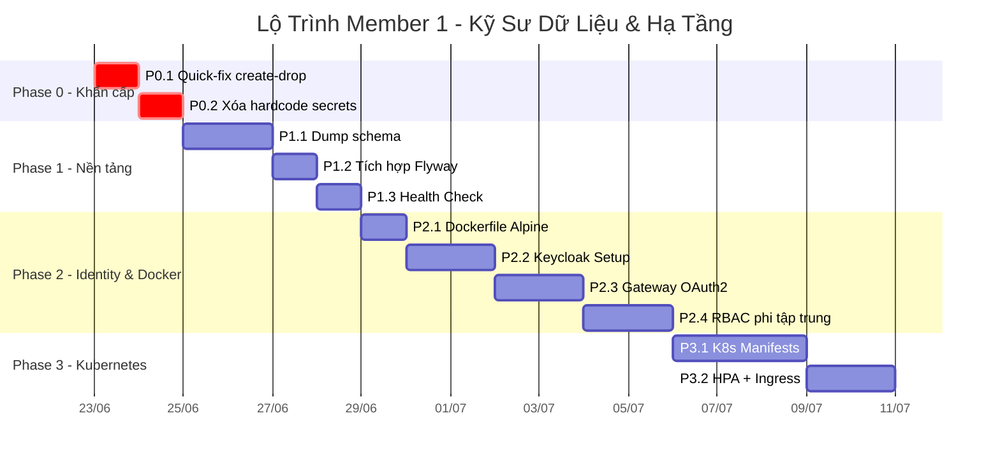

# 🧑‍💻 Member 1: Kế Hoạch Thực Hiện Chi Tiết — Kỹ Sư Dữ Liệu & Hạ Tầng

> **Ngày tạo:** 2026-06-21
> **Dựa trên:** [task.md](file:///Users/thanhnguyen/Documents/chat-server-microservices/tnguyen/update/task.md) + [17_plan_chuan_hoa_kien_truc_microservices.md](file:///Users/thanhnguyen/Documents/chat-server-microservices/tnguyen/update/17_plan_chuan_hoa_kien_truc_microservices.md)
> **Stack:** Java 17 · Spring Boot 3.2.4 · Spring Cloud 2023.0.1 · MySQL 8 · Docker Compose

---

## 📋 Tổng Quan Task Gốc của Member 1

| Phase | Task gốc | Trạng thái |
|---|---|---|
| Phase 1 | Loại bỏ `ddl-auto=update`, tích hợp Flyway, tích hợp Keycloak | ❌ Chưa làm |
| Phase 2 | Viết Spring Security parse JWT Claims (RBAC/CBAC) | ❌ Chưa làm |
| Phase 3 | Helm Charts/K8s, ConfigMap/Secrets, Multi-stage Docker, HPA | ❌ Chưa làm |

---

## 🔴 Đánh Giá Thiếu Sót & Đề Xuất Bổ Sung

> [!WARNING]
> Task gốc của Member 1 có **8 điểm thiếu sót nghiêm trọng** cần bổ sung trước khi thực hiện. Nếu không xử lý, sẽ gây lỗi dây chuyền hoặc phải refactor lại.

### Thiếu sót #1: Không có Phase 0 — Quick-fix Khẩn Cấp
Task gốc nhảy thẳng vào Flyway mà **bỏ qua bước sửa `create-drop`** ở `notification-service` và `file-service`. Nếu ai đó restart Docker trước khi Flyway sẵn sàng → **mất toàn bộ dữ liệu**.

**Bằng chứng:**
- [notification-service/application.yml](file:///Users/thanhnguyen/Documents/chat-server-microservices/notification-service/src/main/resources/application.yml) L18: `ddl-auto: ${SPRING_JPA_DDL_AUTO:create-drop}`
- [file-service/application.yml](file:///Users/thanhnguyen/Documents/chat-server-microservices/file-service/src/main/resources/application.yml) L18: `ddl-auto: ${SPRING_JPA_DDL_AUTO:create-drop}`

### Thiếu sót #2: Không xử lý JWT Secret Hardcode
Task gốc không đề cập đến việc JWT secret đang bị hardcode trực tiếp trong [application.yml](file:///Users/thanhnguyen/Documents/chat-server-microservices/auth-service/src/main/resources/application.yml) L19:
```yaml
secret: ${JWT_SECRET:chatsever-jwt-secret-key-2026-safe-key}
```
Và cả password MySQL hardcode ở L11:
```yaml
password: ${SPRING_DATASOURCE_PASSWORD:Nn3832143}
```

### Thiếu sót #3: Không dọn thư mục `bin/` (rác Eclipse)
Repo chứa nhiều thư mục `bin/` đang bị Git track — đây là rác build của Eclipse IDE cần xóa và thêm vào `.gitignore`.

### Thiếu sót #4: Thiếu kế hoạch Baseline cho Flyway
Khi chuyển từ `ddl-auto=update` sang Flyway, cần `baseline-on-migrate: true` cho database đã có dữ liệu. Task gốc chỉ nói "viết script V1__init_schema.sql" mà không nói rõ quy trình dump schema hiện có.

### Thiếu sót #5: Docker Build hiện tại chưa tối ưu — nhưng chưa quá tệ
Kiểm tra [auth-service/Dockerfile](file:///Users/thanhnguyen/Documents/chat-server-microservices/auth-service/Dockerfile) thấy đã multi-stage nhưng runtime dùng `eclipse-temurin:17-jre-jammy` (Debian-based, ~200MB+). Task gốc nói "chuyển sang Alpine/Distroless" nhưng **thiếu bước trung gian**: test tương thích thư viện native (MySQL connector, gRPC) trước khi chuyển Alpine.

### Thiếu sót #6: Không có non-root user ở Dockerfile hiện tại
[auth-service/Dockerfile](file:///Users/thanhnguyen/Documents/chat-server-microservices/auth-service/Dockerfile) chạy root (không có `USER` directive). Trong khi [Dockerfile.template](file:///Users/thanhnguyen/Documents/chat-server-microservices/Dockerfile.template) đã có `non-root`, nhưng các Dockerfile thực tế không dùng template này.

### Thiếu sót #7: Keycloak quá nặng cho Phase 1
Task gốc đặt Keycloak vào Phase 1 nhưng Master Plan xếp nó ở **P6 (ưu tiên Thấp, rủi ro Rất Cao)**. Đây là contradiction — Member 1 cần làm rõ thứ tự ưu tiên.

### Thiếu sót #8: Thiếu Health Check chuẩn cho các service
Không có Readiness/Liveness probe configuration trong Docker Compose cho các application service (chỉ có cho infra như mysql, rabbitmq).

---

## 🗺️ Lộ Trình Đề Xuất — Chia 10 Micro-Phase

> [!IMPORTANT]
> Lộ trình này sắp xếp lại task gốc theo thứ tự **rủi ro thấp → cao**, **giá trị cao → thấp**, đảm bảo mỗi micro-phase hoàn thành độc lập, có thể build/test/deploy riêng.

| Micro-Phase | Tên | Thời gian | Rủi ro | Ưu tiên |
|---|---|---|---|---|
| **P0.1** | 🚨 Quick-fix `create-drop` + dọn rác | 0.5 ngày | Thấp | 🔴 Ngay lập tức |
| **P0.2** | 🔐 Xóa hardcode secrets + fail-fast | 0.5 ngày | Thấp | 🔴 Ngay lập tức |
| **P1.1** | 📄 Dump schema + viết `V1__init_schema.sql` | 2 ngày | Trung bình | 🟠 Cao |
| **P1.2** | 🔧 Tích hợp Flyway + đổi `ddl-auto: validate` | 1 ngày | Trung bình | 🟠 Cao |
| **P1.3** | 🏥 Health Check cho Application Services | 0.5 ngày | Thấp | 🟠 Cao |
| **P2.1** | 🐳 Tối ưu Dockerfile: Alpine + non-root | 1 ngày | Trung bình | 🟡 TB |
| **P2.2** | 🔑 Keycloak: Setup Docker Compose + Realm | 2 ngày | Cao | 🟡 TB |
| **P2.3** | 🔑 Keycloak: Gateway OAuth2 Resource Server | 2 ngày | Cao | 🟡 TB |
| **P2.4** | 🛡️ Spring Security: Phân quyền RBAC phi tập trung | 2 ngày | TB | 🟡 TB |
| **P3.1** | ☸️ Kubernetes: Manifests + ConfigMap/Secrets | 3 ngày | Cao | 🔵 Thấp |
| **P3.2** | ☸️ Kubernetes: HPA + Ingress | 1.5 ngày | Cao | 🔵 Thấp |

**Tổng ước lượng: ~16 ngày làm việc**

---

## 📐 Chi Tiết Từng Micro-Phase

### P0.1 — 🚨 Quick-fix `create-drop` + Dọn rác (0.5 ngày)

**Mục tiêu:** Chặn ngay rủi ro mất dữ liệu khi restart container.

**Việc cần làm:**

#### 1. Sửa `notification-service`
File: [notification-service/src/main/resources/application.yml](file:///Users/thanhnguyen/Documents/chat-server-microservices/notification-service/src/main/resources/application.yml)
```diff
-      ddl-auto: ${SPRING_JPA_DDL_AUTO:create-drop}
+      ddl-auto: ${SPRING_JPA_DDL_AUTO:update}
```

#### 2. Sửa `file-service`
File: [file-service/src/main/resources/application.yml](file:///Users/thanhnguyen/Documents/chat-server-microservices/file-service/src/main/resources/application.yml)
```diff
-      ddl-auto: ${SPRING_JPA_DDL_AUTO:create-drop}           # Dev: create-drop | Docker: update
+      ddl-auto: ${SPRING_JPA_DDL_AUTO:update}
```

#### 3. Dọn thư mục `bin/` + cập nhật `.gitignore`
```bash
# Thêm vào .gitignore
echo "bin/" >> .gitignore

# Xóa bin/ đang bị track
git rm -r --cached */bin/ 2>/dev/null || true
git rm -r --cached */*/bin/ 2>/dev/null || true
```

**Acceptance Criteria:**
- [ ] `docker compose down && docker compose up` không mất dữ liệu notification/file
- [ ] `git status` không còn thư mục `bin/`
- [ ] Commit: `fix(db): replace create-drop with update to prevent data loss`

---

### P0.2 — 🔐 Xóa Hardcode Secrets + Fail-fast (0.5 ngày)

**Mục tiêu:** Bảo mật — không cho phép app khởi động nếu thiếu secret quan trọng.

**Việc cần làm:**

#### 1. Xóa default JWT secret
File: [auth-service/src/main/resources/application.yml](file:///Users/thanhnguyen/Documents/chat-server-microservices/auth-service/src/main/resources/application.yml)
```diff
 jwt:
-  secret: ${JWT_SECRET:chatsever-jwt-secret-key-2026-safe-key}
+  secret: ${JWT_SECRET}
```

File: [gateway-service/src/main/resources/application.yml](file:///Users/thanhnguyen/Documents/chat-server-microservices/gateway-service/src/main/resources/application.yml)
```diff
 jwt:
-  secret: ${JWT_SECRET:chatsever-jwt-secret-key-2026-safe-key}
+  secret: ${JWT_SECRET}
```

#### 2. Xóa default DB password
File: [auth-service/src/main/resources/application.yml](file:///Users/thanhnguyen/Documents/chat-server-microservices/auth-service/src/main/resources/application.yml)
```diff
-    password: ${SPRING_DATASOURCE_PASSWORD:Nn3832143}
+    password: ${SPRING_DATASOURCE_PASSWORD}
```

#### 3. Tạo file `.env.example` (template cho team)
```env
# Copy file này thành .env và điền giá trị thực
JWT_SECRET=your-jwt-secret-key-at-least-256-bits
MYSQL_ROOT_PASSWORD=your-mysql-password
MYSQL_DATABASE=chat_auth_db
RABBITMQ_DEFAULT_USER=guest
RABBITMQ_DEFAULT_PASS=guest
MINIO_ROOT_USER=minioadmin
MINIO_ROOT_PASSWORD=minioadmin
```

#### 4. Đảm bảo `.env` nằm trong `.gitignore`
```bash
echo ".env" >> .gitignore
```

**Acceptance Criteria:**
- [ ] Thiếu `JWT_SECRET` → app log lỗi rõ ràng và không khởi động
- [ ] Không còn bất kỳ password/secret nào hardcode trong source code
- [ ] File `.env.example` có sẵn để team clone
- [ ] Commit: `security: remove hardcoded secrets, add fail-fast on missing env`

---

### P1.1 — 📄 Dump Schema + Viết V1__init_schema.sql (2 ngày)

**Mục tiêu:** Chuẩn bị Flyway migration scripts cho toàn bộ 9 database.

**Danh sách Database cần dump:**

| # | Service | Database | File Output |
|---|---|---|---|
| 1 | auth-service | `chat_auth_db` | `V1__init_schema.sql` |
| 2 | server-service | `chat_server_db` | `V1__init_schema.sql` |
| 3 | channel-service | `chat_channel_db` | `V1__init_schema.sql` |
| 4 | messaging-service | `chat_messaging_db` | `V1__init_schema.sql` |
| 5 | presence-service | `chat_presence_db` | `V1__init_schema.sql` |
| 6 | notification-service | `chat_notification_db` | `V1__init_schema.sql` |
| 7 | file-service | `chat_file_db` | `V1__init_schema.sql` |
| 8 | user-profile-service | `chat_profile_db` | `V1__init_schema.sql` |
| 9 | role-service | `chat_role_db` | `V1__init_schema.sql` |
| 10 | friend-service | `chat_friend_db` | `V1__init_schema.sql` |

**Quy trình dump cho mỗi service:**
```bash
# 1. Start hệ thống để Hibernate tạo schema
docker compose up mysql-db <service-name> -d

# 2. Dump schema (KHÔNG dump data)
docker exec mysql-db mysqldump \
  --no-data \
  --skip-add-drop-table \
  --skip-comments \
  -u root -p"${MYSQL_ROOT_PASSWORD}" \
  <database_name> > <service>/src/main/resources/db/migration/V1__init_schema.sql

# 3. Cleanup: Đảm bảo mỗi CREATE TABLE có IF NOT EXISTS
sed -i '' 's/CREATE TABLE/CREATE TABLE IF NOT EXISTS/g' \
  <service>/src/main/resources/db/migration/V1__init_schema.sql
```

> [!TIP]
> Làm **tuần tự** từng service, kiểm tra kỹ SQL output trước khi commit. Bắt đầu từ `auth-service` (đơn giản nhất), kết thúc ở `messaging-service` (phức tạp nhất).

**Acceptance Criteria:**
- [ ] 10 file `V1__init_schema.sql` tại `<service>/src/main/resources/db/migration/`
- [ ] Mỗi file SQL chạy được trên DB trống mà không lỗi
- [ ] Commit: `feat(flyway): add V1 init schema for all 10 databases`

---

### P1.2 — 🔧 Tích Hợp Flyway + Đổi `ddl-auto: validate` (1 ngày)

**Mục tiêu:** Bật Flyway cho toàn bộ service, vô hiệu hóa Hibernate DDL auto.

**Việc cần làm:**

#### 1. Thêm dependency Flyway vào parent pom hoặc từng service
```xml
<!-- Thêm vào pom.xml của mỗi service có DB -->
<dependency>
    <groupId>org.flywaydb</groupId>
    <artifactId>flyway-core</artifactId>
</dependency>
<dependency>
    <groupId>org.flywaydb</groupId>
    <artifactId>flyway-mysql</artifactId>
</dependency>
```

#### 2. Cập nhật `application.yml` cho mỗi service
```yaml
spring:
  jpa:
    hibernate:
      ddl-auto: validate    # Chỉ validate, KHÔNG modify schema
  flyway:
    enabled: true
    baseline-on-migrate: true    # QUAN TRỌNG: cho DB đã có data
    baseline-version: 0          # Baseline version trước V1
    locations: classpath:db/migration
```

#### 3. Xóa tất cả `SPRING_JPA_DDL_AUTO` trong docker-compose.yml
File: [docker-compose.yml](file:///Users/thanhnguyen/Documents/chat-server-microservices/docker-compose.yml)
```diff
   auth-service:
     environment:
-      - SPRING_JPA_DDL_AUTO=update
```
(Lặp lại cho: `notification-service`, `file-service`, `role-service`, `user-profile-service`, `friend-service`)

**Acceptance Criteria:**
- [ ] Mỗi service khởi động → tạo bảng `flyway_schema_history`
- [ ] `ddl-auto: validate` không báo lỗi schema mismatch
- [ ] Restart container không đổi schema
- [ ] Commit: `feat(flyway): integrate flyway migration, switch to ddl-auto validate`

---

### P1.3 — 🏥 Health Check cho Application Services (0.5 ngày)

**Mục tiêu:** Bổ sung Actuator health endpoint và Docker health check cho các application service.

> [!NOTE]
> Đây là task **mới bổ sung**, không có trong task gốc. Cần thiết để Docker/K8s biết service đã sẵn sàng nhận traffic.

**Việc cần làm:**

#### 1. Đảm bảo Actuator dependency có trong mỗi service
```xml
<dependency>
    <groupId>org.springframework.boot</groupId>
    <artifactId>spring-boot-starter-actuator</artifactId>
</dependency>
```

#### 2. Thêm health check vào docker-compose.yml cho mỗi app service
```yaml
  auth-service:
    healthcheck:
      test: ["CMD-SHELL", "curl -f http://localhost:8081/actuator/health || exit 1"]
      interval: 15s
      timeout: 5s
      retries: 5
      start_period: 30s
```

#### 3. Cập nhật depends_on dùng `condition: service_healthy`
```yaml
  gateway-service:
    depends_on:
      auth-service:
        condition: service_healthy    # Thay vì service_started
```

**Acceptance Criteria:**
- [ ] Tất cả app service có health check hoạt động
- [ ] `docker compose up` chờ service healthy trước khi start gateway
- [ ] Commit: `feat(docker): add health checks for all application services`

---

### P2.1 — 🐳 Tối Ưu Dockerfile: Alpine + Non-root (1 ngày)

**Mục tiêu:** Giảm image size, tăng bảo mật container.

**Việc cần làm cho mỗi Dockerfile (12 services):**

#### Template Dockerfile chuẩn mới:
```dockerfile
# syntax=docker/dockerfile:1.6
# ======== BUILD STAGE ========
FROM maven:3.9-eclipse-temurin-17 AS build
WORKDIR /build

COPY pom.xml ./
COPY common-lib/pom.xml common-lib/pom.xml
COPY <service-name>/pom.xml <service-name>/pom.xml
# ... (giữ nguyên logic cache dependency hiện tại)

RUN mvn dependency:go-offline -pl <service-name> -am -q || true
COPY . .
RUN mvn -pl <service-name> -am clean package -DskipTests -q

# ======== RUNTIME STAGE ========
FROM eclipse-temurin:17-jre-alpine

# Security: non-root user
RUN addgroup -S appgroup && adduser -S appuser -G appgroup

WORKDIR /app
COPY --from=build --chown=appuser:appgroup \
    /build/<service-name>/target/<service-name>-1.0.0-SNAPSHOT.jar app.jar

USER appuser

ENV TZ=Asia/Ho_Chi_Minh
ENV JAVA_OPTS="-XX:+UseContainerSupport -XX:MaxRAMPercentage=75.0 -XX:+UseG1GC -XX:+ExitOnOutOfMemoryError"

EXPOSE <port>
ENTRYPOINT ["sh", "-c", "exec java ${JAVA_OPTS} -jar /app/app.jar"]
```

**Sự thay đổi chính:**
| Trước | Sau | Lợi ích |
|---|---|---|
| `eclipse-temurin:17-jre-jammy` (~230MB) | `eclipse-temurin:17-jre-alpine` (~110MB) | Giảm 50%+ image size |
| Chạy root | `USER appuser` | Chặn leo thang đặc quyền |
| Không có `exec` | `exec java ...` | PID 1 nhận signal SIGTERM đúng |

> [!WARNING]
> Sau khi đổi Alpine, **phải test kỹ** từng service vì một số thư viện native (glibc vs musl). Nếu gặp lỗi, fallback về `eclipse-temurin:17-jre-alpine` + cài `gcompat`.

**Acceptance Criteria:**
- [ ] Tất cả 12 Dockerfile dùng Alpine + non-root
- [ ] `docker compose build` không lỗi
- [ ] Image size giảm ít nhất 40% so với trước
- [ ] `docker compose up` + smoke test gửi tin nhắn thành công
- [ ] Commit: `perf(docker): switch to alpine images with non-root user`

---

### P2.2 — 🔑 Keycloak: Setup Docker Compose + Realm (2 ngày)

**Mục tiêu:** Triển khai Keycloak trên Docker Compose, cấu hình Realm cho hệ thống chat.

> [!CAUTION]
> Đây là phase rủi ro cao. Cần xác nhận yêu cầu đồ án trước khi làm. Nếu giảng viên không yêu cầu IdP tập trung, có thể **BỎ QUA** P2.2 + P2.3 và giữ `auth-service` hiện tại.

**Việc cần làm:**

#### 1. Thêm Keycloak vào `docker-compose.yml`
```yaml
  keycloak-db:
    image: mysql:8.0
    container_name: keycloak-db
    environment:
      MYSQL_ROOT_PASSWORD: ${KC_DB_PASSWORD:-keycloak_pass}
      MYSQL_DATABASE: keycloak
    volumes:
      - keycloak-db-data:/var/lib/mysql
    healthcheck:
      test: ["CMD", "mysqladmin", "ping", "-h", "localhost"]
      interval: 10s
      timeout: 5s
      retries: 10
    networks:
      - chat-net

  keycloak:
    image: quay.io/keycloak/keycloak:24.0
    container_name: keycloak
    command: start-dev --import-realm
    environment:
      KC_DB: mysql
      KC_DB_URL: jdbc:mysql://keycloak-db:3306/keycloak
      KC_DB_USERNAME: root
      KC_DB_PASSWORD: ${KC_DB_PASSWORD:-keycloak_pass}
      KEYCLOAK_ADMIN: admin
      KEYCLOAK_ADMIN_PASSWORD: ${KC_ADMIN_PASSWORD:-admin}
    ports:
      - "8180:8080"
    volumes:
      - ./devops/keycloak/realm-export.json:/opt/keycloak/data/import/realm-export.json
    depends_on:
      keycloak-db:
        condition: service_healthy
    networks:
      - chat-net
```

#### 2. Tạo Realm Export File
File: `devops/keycloak/realm-export.json`
- Realm: `chatserver`
- Client: `chat-client` (public client, OIDC)
- Roles: `ROLE_USER`, `ROLE_ADMIN`, `ROLE_SERVER_OWNER`
- Mappers: `sub` → userId, `realm_access.roles` → roles claim

#### 3. Viết script migrate user từ `chat_auth_db` → Keycloak
File: `devops/keycloak/migrate-users.sh`
- Đọc user từ MySQL `chat_auth_db`
- Gọi Keycloak Admin REST API tạo user tương ứng

**Acceptance Criteria:**
- [ ] `docker compose up keycloak` chạy thành công
- [ ] Truy cập `http://localhost:8180` → Keycloak Admin Console
- [ ] Realm `chatserver` được import tự động
- [ ] Commit: `feat(keycloak): add keycloak to docker-compose with chatserver realm`

---

### P2.3 — 🔑 Keycloak: Gateway OAuth2 Resource Server (2 ngày)

**Mục tiêu:** Gateway xác thực JWT từ Keycloak thay vì tự verify.

**Việc cần làm:**

#### 1. Thêm dependency vào gateway-service
```xml
<dependency>
    <groupId>org.springframework.boot</groupId>
    <artifactId>spring-boot-starter-oauth2-resource-server</artifactId>
</dependency>
```

#### 2. Cấu hình Gateway xác thực bằng JWKS
```yaml
spring:
  security:
    oauth2:
      resourceserver:
        jwt:
          issuer-uri: ${KEYCLOAK_ISSUER_URI:http://keycloak:8080/realms/chatserver}
          jwk-set-uri: ${KEYCLOAK_JWKS_URI:http://keycloak:8080/realms/chatserver/protocol/openid-connect/certs}
```

#### 3. Thay thế `JwtAuthFilter` tự chế bằng Spring Security filter chain
```java
@Configuration
@EnableWebFluxSecurity
public class SecurityConfig {
    @Bean
    public SecurityWebFilterChain springSecurityFilterChain(ServerHttpSecurity http) {
        return http
            .csrf(csrf -> csrf.disable())
            .authorizeExchange(auth -> auth
                .pathMatchers("/api/auth/**").permitAll()
                .pathMatchers("/ws/**").permitAll()
                .anyExchange().authenticated()
            )
            .oauth2ResourceServer(oauth2 -> oauth2
                .jwt(jwt -> jwt.jwtAuthenticationConverter(keycloakJwtConverter()))
            )
            .build();
    }
}
```

#### 4. Truyền thông tin user qua header cho downstream
- Trích `sub` claim → header `X-User-Id`
- Trích `realm_access.roles` → header `X-User-Roles`

**Acceptance Criteria:**
- [ ] Gateway verify token qua Keycloak JWKS (không cần shared secret)
- [ ] Token hết hạn → 401 Unauthorized
- [ ] Token hợp lệ → downstream nhận được `X-User-Id` header
- [ ] `auth-service` REST endpoint `/api/auth/login` vẫn hoạt động (giai đoạn chuyển tiếp)
- [ ] Commit: `feat(gateway): integrate oauth2 resource server with keycloak`

---

### P2.4 — 🛡️ Spring Security: Phân Quyền RBAC Phi Tập Trung (2 ngày)

**Mục tiêu:** Mỗi service tự parse JWT claims để phân quyền, không gọi ngược Keycloak.

**Việc cần làm:**

#### 1. Tạo shared security config trong `common-lib`
```java
// common-lib: JwtClaimsExtractor.java
public class JwtClaimsExtractor {
    
    public static Long getUserId(HttpServletRequest request) {
        String userId = request.getHeader("X-User-Id");
        if (userId == null) throw new UnauthorizedException("Missing user identity");
        return Long.parseLong(userId);
    }
    
    public static Set<String> getRoles(HttpServletRequest request) {
        String roles = request.getHeader("X-User-Roles");
        if (roles == null) return Collections.emptySet();
        return Arrays.stream(roles.split(","))
                     .map(String::trim)
                     .collect(Collectors.toSet());
    }
    
    public static boolean hasRole(HttpServletRequest request, String role) {
        return getRoles(request).contains(role);
    }
}
```

#### 2. Mỗi downstream service cấu hình SecurityFilterChain
```java
@Configuration
@EnableWebSecurity
public class InternalSecurityConfig {
    @Bean
    public SecurityFilterChain filterChain(HttpSecurity http) throws Exception {
        return http
            .csrf(csrf -> csrf.disable())
            .sessionManagement(s -> s.sessionCreationPolicy(STATELESS))
            .authorizeHttpRequests(auth -> auth
                .requestMatchers("/actuator/**").permitAll()
                .anyRequest().authenticated()
            )
            .addFilterBefore(new InternalAuthFilter(), UsernamePasswordAuthenticationFilter.class)
            .build();
    }
}
```

#### 3. `InternalAuthFilter` — parse header từ Gateway
```java
public class InternalAuthFilter extends OncePerRequestFilter {
    @Override
    protected void doFilterInternal(HttpServletRequest request, ...) {
        String userId = request.getHeader("X-User-Id");
        if (userId != null) {
            Set<String> roles = JwtClaimsExtractor.getRoles(request);
            List<GrantedAuthority> authorities = roles.stream()
                .map(SimpleGrantedAuthority::new)
                .collect(Collectors.toList());
            var auth = new UsernamePasswordAuthenticationToken(userId, null, authorities);
            SecurityContextHolder.getContext().setAuthentication(auth);
        }
        filterChain.doFilter(request, response);
    }
}
```

**Acceptance Criteria:**
- [ ] Downstream service phân quyền dựa trên JWT claims, không gọi mạng
- [ ] API có `@PreAuthorize("hasRole('ADMIN')")` hoạt động đúng
- [ ] Service nội bộ (gRPC/Feign) truyền claims qua interceptor
- [ ] Commit: `feat(security): implement decentralized RBAC using JWT claims`

---

### P3.1 — ☸️ Kubernetes: Manifests + ConfigMap/Secrets (3 ngày)

**Mục tiêu:** Viết YAML manifests để triển khai toàn bộ hệ thống trên Kubernetes.

> [!IMPORTANT]
> Phase này chỉ thực hiện khi team xác nhận sẽ deploy lên K8s. Nếu giữ Docker Compose → **BỎ QUA P3.1 + P3.2**.

**Cấu trúc thư mục:**
```
k8s/
├── base/
│   ├── namespace.yaml
│   ├── configmap.yaml
│   ├── secrets.yaml          # (template, giá trị thật dùng sealed-secrets)
│   ├── mysql/
│   │   ├── deployment.yaml
│   │   ├── service.yaml
│   │   └── pvc.yaml
│   ├── rabbitmq/
│   │   ├── deployment.yaml
│   │   └── service.yaml
│   ├── keycloak/
│   │   ├── deployment.yaml
│   │   └── service.yaml
│   └── services/
│       ├── auth-service.yaml
│       ├── gateway-service.yaml
│       ├── server-service.yaml
│       ├── channel-service.yaml
│       ├── messaging-service.yaml
│       ├── presence-service.yaml
│       ├── notification-service.yaml
│       ├── file-service.yaml
│       ├── log-service.yaml
│       ├── role-service.yaml
│       ├── user-profile-service.yaml
│       └── friend-service.yaml
├── overlays/
│   ├── dev/
│   │   └── kustomization.yaml
│   └── prod/
│       └── kustomization.yaml
└── kustomization.yaml
```

**Template cho mỗi service:**
```yaml
apiVersion: apps/v1
kind: Deployment
metadata:
  name: auth-service
  namespace: chatserver
spec:
  replicas: 2
  selector:
    matchLabels:
      app: auth-service
  template:
    metadata:
      labels:
        app: auth-service
    spec:
      containers:
        - name: auth-service
          image: hoangnguyen1007/auth-service:latest
          ports:
            - containerPort: 8081
          envFrom:
            - configMapRef:
                name: chatserver-config
            - secretRef:
                name: chatserver-secrets
          resources:
            requests:
              memory: "256Mi"
              cpu: "100m"
            limits:
              memory: "512Mi"
              cpu: "500m"
          readinessProbe:
            httpGet:
              path: /actuator/health/readiness
              port: 8081
            initialDelaySeconds: 30
            periodSeconds: 10
          livenessProbe:
            httpGet:
              path: /actuator/health/liveness
              port: 8081
            initialDelaySeconds: 45
            periodSeconds: 15
```

**Acceptance Criteria:**
- [ ] `kubectl apply -k k8s/overlays/dev/` triển khai thành công trên minikube/kind
- [ ] Tất cả Pod ở trạng thái Running + Ready
- [ ] ConfigMap/Secrets chứa đúng config
- [ ] Commit: `feat(k8s): add kubernetes manifests with kustomize`

---

### P3.2 — ☸️ Kubernetes: HPA + Ingress (1.5 ngày)

**Mục tiêu:** Auto-scaling và expose service ra ngoài cluster.

**Việc cần làm:**

#### 1. HPA cho các service có traffic cao
```yaml
apiVersion: autoscaling/v2
kind: HorizontalPodAutoscaler
metadata:
  name: messaging-service-hpa
  namespace: chatserver
spec:
  scaleTargetRef:
    apiVersion: apps/v1
    kind: Deployment
    name: messaging-service
  minReplicas: 2
  maxReplicas: 10
  metrics:
    - type: Resource
      resource:
        name: cpu
        target:
          type: Utilization
          averageUtilization: 70
    - type: Resource
      resource:
        name: memory
        target:
          type: Utilization
          averageUtilization: 80
```

#### 2. Ingress cho Gateway
```yaml
apiVersion: networking.k8s.io/v1
kind: Ingress
metadata:
  name: chatserver-ingress
  namespace: chatserver
  annotations:
    nginx.ingress.kubernetes.io/websocket-services: "gateway-service"
spec:
  rules:
    - host: chat.local
      http:
        paths:
          - path: /
            pathType: Prefix
            backend:
              service:
                name: gateway-service
                port:
                  number: 8080
```

**Acceptance Criteria:**
- [ ] HPA scale messaging-service khi CPU > 70%
- [ ] Ingress route traffic từ `chat.local` → gateway-service
- [ ] WebSocket kết nối ổn định qua Ingress
- [ ] Commit: `feat(k8s): add HPA autoscaling and ingress`

---

## 📊 Tổng Kết Lộ Trình



---

## User Review Required

> [!IMPORTANT]
> **Câu hỏi cần Member 1 / Team Lead trả lời trước khi bắt tay thực hiện:**
>
> 1. **Keycloak có bắt buộc không?** Master Plan xếp P6 (ưu tiên Thấp), nhưng task gốc đặt Phase 1. Nếu không bắt buộc → bỏ P2.2, P2.3, P2.4 → tiết kiệm **~6 ngày**.
> 2. **Kubernetes có bắt buộc không?** Nếu giữ Docker Compose → bỏ P3.1, P3.2 → tiết kiệm **~4.5 ngày**.
> 3. **Có cần giữ `auth-service` song song** trong giai đoạn chuyển tiếp Keycloak không? (Khuyến nghị: Có, ít nhất 2 tuần)
> 4. **Deadline tổng thể là bao lâu?** Lộ trình đầy đủ ~16 ngày. Nếu bỏ Keycloak + K8s → ~5.5 ngày.

---

## Verification Plan

### Automated Tests
- Mỗi micro-phase: `./mvnw clean package` xanh hoàn toàn
- Flyway: unit test với H2 in-memory chạy migration
- Docker: `docker compose build && docker compose up` + smoke test

### Manual Verification
- P0: Restart container → verify data không mất
- P1: Kiểm tra `flyway_schema_history` trong mỗi DB
- P2: Login qua Keycloak → gửi tin nhắn → verify JWT flow end-to-end
- P3: `kubectl get pods` → all Running/Ready, test HPA bằng stress test
